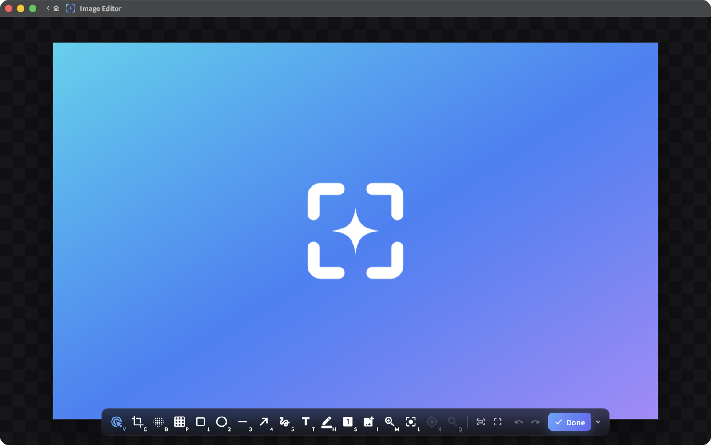

# Glimpr

[](LICENSE)
[](https://github.com/howar31/glimpr/releases/latest)
[](https://glimpr.howar31.com)
[](https://github.com/howar31/glimpr/actions/workflows/ci.yml)
[](https://github.com/howar31/glimpr/releases)
[](https://ko-fi.com/howar31)

English | [繁體中文](README.zh-Hant.md)

Fast, native screenshot, annotation, and screen-recording tool for macOS and
Windows. Website: [glimpr.howar31.com](https://glimpr.howar31.com)

<picture>
  <source media="(prefers-color-scheme: dark)" srcset="docs/media/editor-mac.png">
  <source media="(prefers-color-scheme: light)" srcset="docs/media/editor-mac-light.png">
  
</picture>

## Features

- **Screenshot** – interactive region, window, and display screenshots on a
  frozen, pixel-faithful overlay; window snap and element snap
  (accessibility-based); multi-display support; HDR-aware screenshots
  (HEIC / JPEG XR) alongside SDR.
- **Annotate** – 12 tools (rectangle, ellipse, line, arrow, pen, highlighter,
  text, numbered steps, blur, pixelate, spotlight, crop) in the capture
  overlay and a standalone image editor, with a pixel loupe and eyedropper.
- **Record** – screen recording (H.264 / HEVC including HDR10, GIF) in
  region, window, display, and last-region modes; system audio and
  microphone; pause / resume; auto-stop.
- **GIF Editor** – edit any GIF on a frame timeline: trim, reorder and
  retime frames, crop / resize / rotate, burn in annotations, transitions,
  smooth loop, cinemagraph and a progress bar; re-encodes with an adaptive
  palette, optional dithering and file-size optimization.
- **Pin** – float any screenshot as an always-on-top pin with drag and zoom.
- **Flows** – configurable after-capture and after-edit actions: save, copy,
  open editor, pin, share; filename templates and date subfolders.
- Rebindable global hotkeys (including PrintScreen and bare keys), light and
  dark themes, English and Traditional Chinese.
- **Private by design** – no telemetry, no account; captures never leave your
  machine. The only network request is the update check, and it can be turned
  off.

## Install

**macOS 14+** (screen recording requires macOS 15+) — download the DMG from
[Releases](https://github.com/howar31/glimpr/releases) and drag Glimpr to
Applications. Grant Screen Recording (and optionally Accessibility for
element snap) on first run.

**Windows 10 (1903+) / 11** — download the installer or the portable zip from
[Releases](https://github.com/howar31/glimpr/releases). SmartScreen may warn
about the unsigned installer: choose "More info", then "Run anyway".

Installed builds update themselves: when a new release is out, updating is
one click from the tray menu or the About pane.

## Build from source

Requires Flutter 3.44 / Dart 3.12.

```
flutter pub get
flutter build macos --release    # macOS (Xcode 26)
flutter build windows --release  # Windows (VS 2022 C++ toolchain)
```

The public repo builds the complete free tier. `packages/glimpr_pro` is a
no-op stub package by design; see [CONTRIBUTING](CONTRIBUTING.md).

## Support

If Glimpr is useful to you, you can support development:
[☕ Ko-fi](https://ko-fi.com/howar31) · [💸 PayPal](https://donate.howar31.com)

## License

[Apache-2.0](LICENSE) © 2026 Howar31
