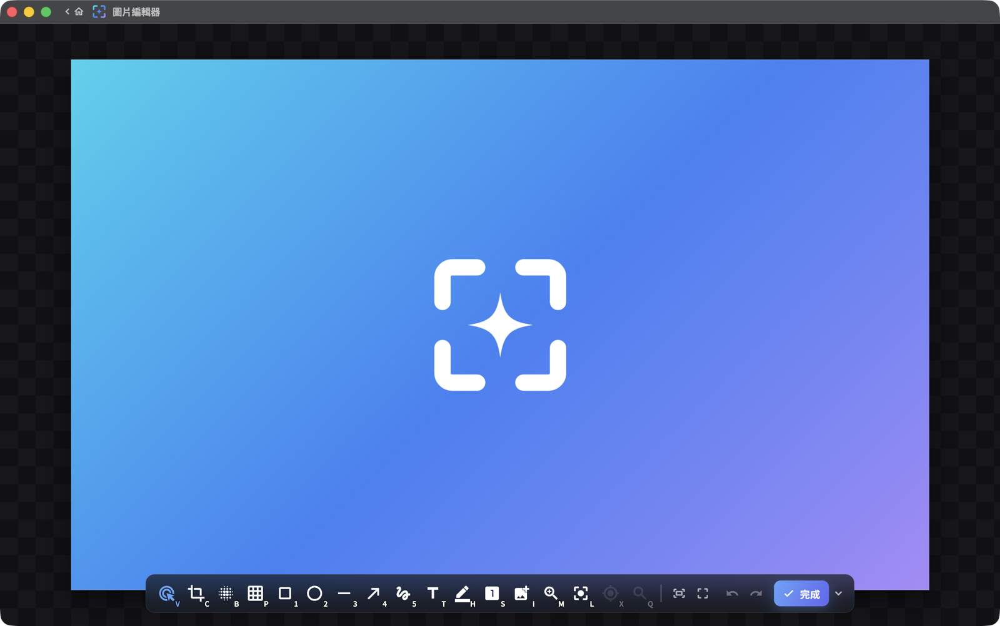

# Glimpr

[](LICENSE)
[](https://github.com/howar31/glimpr/releases/latest)
[](https://glimpr.howar31.com)
[](https://github.com/howar31/glimpr/actions/workflows/ci.yml)
[](https://github.com/howar31/glimpr/releases)
[](https://ko-fi.com/howar31)

[English](README.md) | 繁體中文

macOS 與 Windows 上快速、原生的螢幕截圖、標註與螢幕錄影工具。官方網站：[glimpr.howar31.com](https://glimpr.howar31.com)

<picture>
  <source media="(prefers-color-scheme: dark)" srcset="docs/media/editor-mac-zh.png">
  <source media="(prefers-color-scheme: light)" srcset="docs/media/editor-mac-zh-light.png">
  
</picture>

## 特色

- **截圖**：互動式框選範圍、視窗與螢幕截圖，在畫面凍結、逐像素精準的擷取畫面上操作；視窗框選與元素框選（透過系統輔助功能）；多螢幕支援；HDR 截圖（HEIC／JPEG XR）與 SDR 並存。
- **標註**：12 種工具（矩形、橢圓、直線、箭頭、畫筆、螢光筆、文字、編號標記、模糊、像素化、聚光燈、裁切），擷取畫面與獨立的圖片編輯器皆可使用，內建像素放大鏡與取色器。
- **錄影**：螢幕錄影（H.264／HEVC 含 HDR10、GIF），支援框選範圍、視窗、螢幕與上次範圍模式；系統音訊與麥克風；暫停／繼續；自動停止。
- **GIF 編輯器**：在幀時間軸上編輯任何 GIF：修剪、排序與調整幀延遲、裁切／調整大小／旋轉、燒入標註、轉場、平滑循環、局部動態與進度列；以自適應調色盤重新編碼，可選抖動與檔案大小最佳化。
- **釘選**：把任何截圖以最上層浮動視窗釘在畫面上，可拖曳與縮放。
- **完成流程**：可自訂截圖後與編輯後的動作（儲存、複製、開啟圖片編輯器、釘選、分享）；檔名範本與日期子資料夾。
- 可重新綁定的全域快捷鍵（含 PrintScreen 與不需修飾鍵的單鍵）、淺色與深色主題、英文與繁體中文介面。
- **隱私優先**：無遙測、無帳號；截圖內容不會離開你的電腦。唯一的網路連線是檢查更新，且可以關閉。

## 安裝

**macOS 14+**（螢幕錄影需 macOS 15+）：從
[Releases](https://github.com/howar31/glimpr/releases) 下載 DMG，把 Glimpr
拖進「應用程式」。首次啟動時授權「螢幕錄製」（若要使用元素框選，可另外授權「輔助使用」）。

**Windows 10 (1903+) / 11**：從
[Releases](https://github.com/howar31/glimpr/releases) 下載安裝檔或可攜版
zip。SmartScreen 可能對未簽章的安裝檔顯示警告：選「其他資訊」→「仍要執行」。

已安裝的版本會自我更新：有新版本時，從選單列（系統匣）選單或「關於」頁面一鍵完成更新。

## 從原始碼建置

需要 Flutter 3.44 / Dart 3.12。

```
flutter pub get
flutter build macos --release    # macOS (Xcode 26)
flutter build windows --release  # Windows (VS 2022 C++ toolchain)
```

公開 repo 建置出完整的免費版本。`packages/glimpr_pro` 是刻意保留的 no-op
stub 套件；詳見 [CONTRIBUTING](CONTRIBUTING.md)。

## 贊助

如果 Glimpr 對你有幫助，歡迎贊助開發：
[☕ Ko-fi](https://ko-fi.com/howar31) · [💸 PayPal](https://donate.howar31.com)

## 授權

[Apache-2.0](LICENSE) © 2026 Howar31
